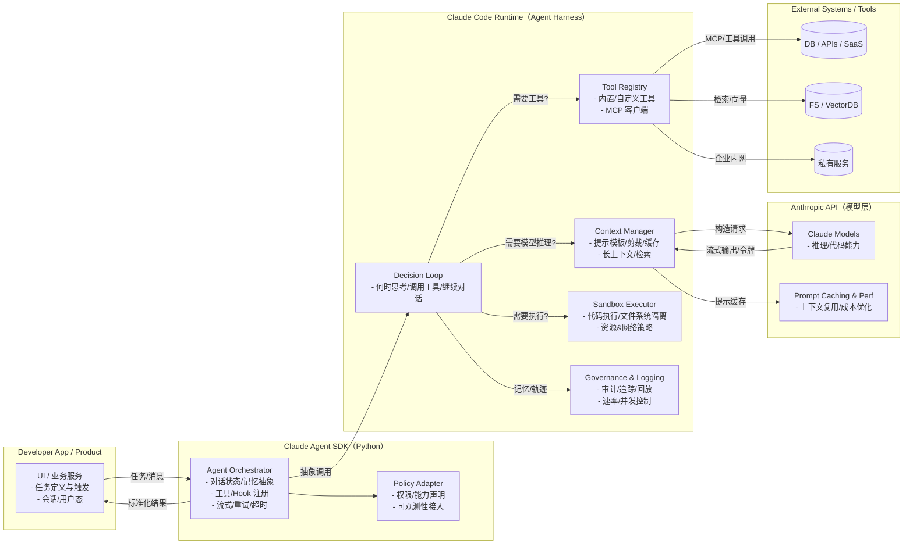
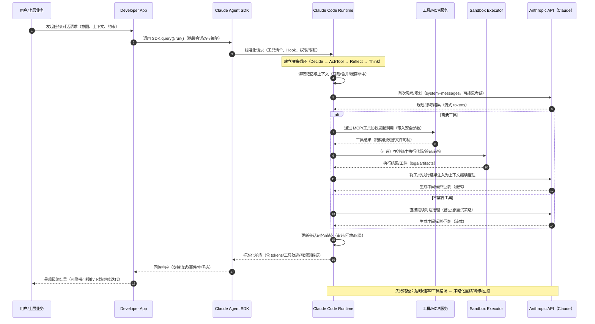
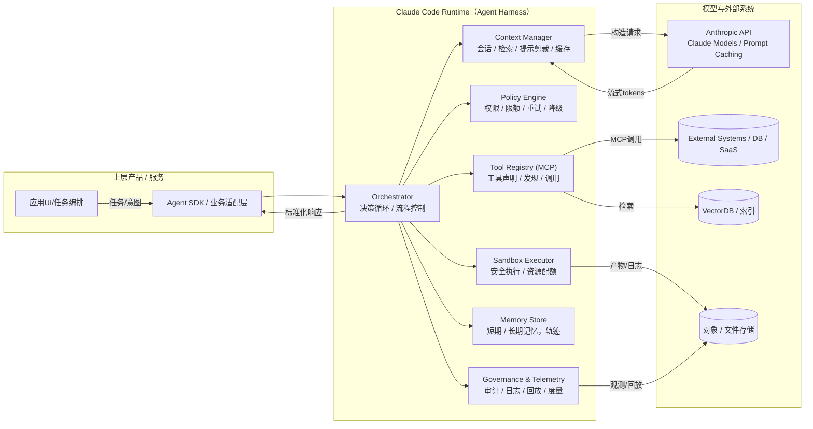
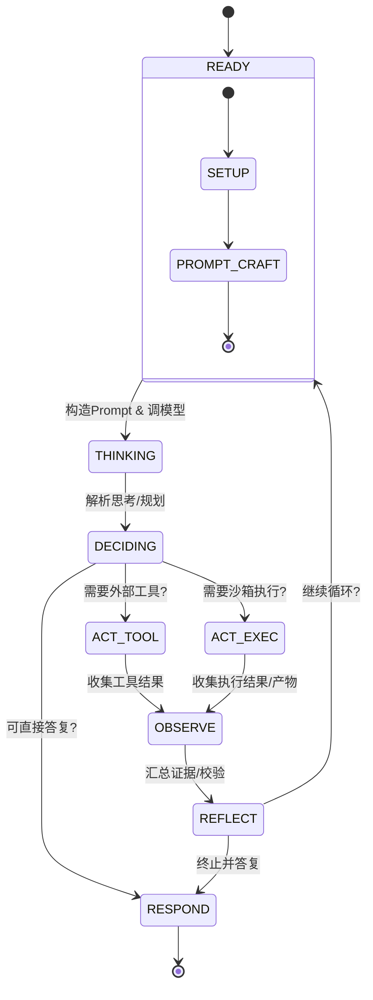

# Claude Agent SDK - 技术细节说明



## v.s Claude Code
### 总揽（分层与边界）


### 生命周期与状态机

### 数据契约
请求
``` json
{
  "session_id": "string",
  "actor": "user|system|cron",
  "goal": "string",
  "inputs": { "k": "v" },
  "constraints": {
    "tools": ["db.search", "http.fetch"],
    "max_steps": 12,
    "hard_timeout_ms": 45000,
    "budget_tokens": 200000
  },
  "policy_overrides": { "allow_network": true, "allow_fs": false }
}
```

工具
``` json
{
  "name": "db.search",
  "version": "1.2.0",
  "schema": {
    "type": "object",
    "properties": {
      "query": { "type": "string" },
      "top_k": { "type": "integer", "minimum": 1, "maximum": 100 }
    },
    "required": ["query"]
  },
  "auth": "inherited|api_key|oauth2",
  "limits": { "rps": 5, "concurrency": 2 },
  "side_effects": false
}
```

观测
``` json
{
  "tool": "db.search",
  "args": { "query": "error budget dashboard", "top_k": 5 },
  "observation": {
    "ok": true,
    "data": [{ "title": "SRE guide", "url": "..." }],
    "latency_ms": 132,
    "cost": { "calls": 1 }
  }
}
```

沙箱
``` json
{
  "exec_id": "uuid",
  "policy": { "cpu_ms": 5000, "mem_mb": 256, "net": "deny" },
  "stdout": "string",
  "stderr": "string",
  "exit_code": 0,
  "artifacts": [
    { "path": "reports/summary.md", "sha256": "..." }
  ],
  "logs_ref": "s3://.../exec_id.log"
}
```

轨迹
``` json
{
  "ts": "2025-10-11T13:45:12Z",
  "session_id": "string",
  "step": 5,
  "event": "tool.invoke|model.call|exec.run|respond",
  "payload": {},
  "usage": { "input_tokens": 1234, "output_tokens": 876 },
  "policy": { "allow_network": false },
  "span_id": "trace-span-id"
}
```
## 数据流详解

### 完整数据流向

```
用户应用 → Python SDK → InternalClient → SubprocessCLITransport → Claude Code CLI → Anthropic API
   ↑                                                                        ↓
   ← 结构化响应 ← 类型化消息 ← MessageParser ← JSON 流响应 ← HTTP 响应 ←
```

### 1. 进程间通信机制

#### 子进程管理
- **实现位置**: `src/claude_agent_sdk/_internal/transport/subprocess_cli.py`
- **技术栈**: `anyio` 异步进程管理
- **通信方式**: stdin/stdout 流式通信

```python
# 关键实现细节
class SubprocessCLITransport:
    def __init__(self, prompt, options, cli_path=None):
        self._process: Process | None = None
        self._stdout_stream: TextReceiveStream | None = None
        self._stdin_stream: TextSendStream | None = None
        self._stderr_stream: TextReceiveStream | None = None
```

#### 进程启动流程
1. **CLI 发现**: 自动查找 Claude Code CLI 安装位置
2. **命令构建**: 根据选项构建 CLI 命令参数
3. **进程启动**: 使用 anyio 启动子进程
4. **流连接**: 连接 stdin/stdout/stderr 流
5. **版本检查**: 验证 Claude Code 版本兼容性 (≥2.0.0)

#### CLI 路径查找逻辑
```python
def _find_cli(self) -> str:
    # 1. 使用 shutil.which() 查找 PATH 中的 claude
    if cli := shutil.which("claude"):
        return cli

    # 2. 检查常见安装位置
    locations = [
        Path.home() / ".npm-global/bin/claude",
        Path("/usr/local/bin/claude"),
        Path.home() / ".local/bin/claude",
        Path.home() / "node_modules/.bin/claude",
        Path.home() / ".yarn/bin/claude",
    ]
```

### 2. 消息协议详解

#### JSON 流协议
- **协议类型**: 流式 JSON (stream-json)
- **CLI 参数**: `--output-format stream-json --verbose`
- **消息格式**: 每行一个 JSON 对象

#### 消息类型结构
```python
# 消息类型层次结构
Message
├── UserMessage (用户消息)
├── AssistantMessage (助手消息)
├── SystemMessage (系统消息)
└── ResultMessage (结果消息)
```

#### 内容块类型
```python
ContentBlock
├── TextBlock (文本内容)
├── ToolUseBlock (工具使用)
├── ToolResultBlock (工具结果)
└── ThinkingBlock (思考过程)
```

#### 消息解析流程
1. **流读取**: 从 stdout 逐行读取 JSON
2. **JSON 解析**: 将字符串解析为字典
3. **类型识别**: 根据消息类型创建相应对象
4. **内容解析**: 解析内容块并类型化
5. **错误处理**: 处理解析错误和协议错误

```python
# 消息解析关键代码
async def parse_message(line: str) -> Message:
    try:
        data = json.loads(line)
        message_type = data.get("type")

        if message_type == "user":
            return UserMessage.from_dict(data)
        elif message_type == "assistant":
            return AssistantMessage.from_dict(data)
        # ... 其他类型
    except json.JSONDecodeError as e:
        raise CLIJSONDecodeError(f"Failed to parse JSON: {e}")
```

### 3. 异步处理架构

#### 异步运行时
- **主要运行时**: `anyio` (支持 asyncio 和 trio)
- **并发模型**: 协程 + 任务组
- **流处理**: 异步流式 I/O

#### 任务组管理
```python
class ClaudeSDKClient:
    async def __aenter__(self):
        # 创建任务组管理后台任务
        self._task_group = create_task_group()

    async def __aexit__(self, exc_type, exc_val, exc_tb):
        # 清理任务组和资源
        await self._task_group.__aexit__(exc_type, exc_val, exc_tb)
```

#### 流式处理实现
```python
# 异步迭代器模式
async def receive_messages(self) -> AsyncIterator[Message]:
    """持续接收消息的异步迭代器"""
    while self._connected:
        try:
            message = await self._message_queue.get()
            yield message
        except AnyioError:
            break
```

#### 背压控制
- **缓冲区限制**: 默认 1MB 缓冲区大小
- **队列管理**: 使用异步队列控制消息流
- **内存保护**: 防止大量消息累积在内存中

### 4. 控制协议详解

#### 控制消息类型
- **工具调用请求**: 请求 Claude 使用特定工具
- **权限查询**: 查询工具使用权限
- **钩子执行**: 在特定事件点执行钩子
- **MCP 通信**: 与 MCP 服务器通信

#### 权限控制流程
```python
# 权限决策流程
async def check_tool_permission(tool_name: str, tool_input: dict) -> PermissionResult:
    # 1. 检查 allowed_tools 列表
    # 2. 执行 can_use_tool 回调 (如果存在)
    # 3. 触发 PreToolUse 钩子
    # 4. 返回权限决策
```

#### 钩子执行机制
```python
# 钩子匹配和执行
async def execute_hooks(event: HookEvent, context: HookContext) -> dict:
    results = {}
    for matcher in self._hooks.get(event, []):
        if matcher.matches(context):
            for hook in matcher.hooks:
                result = await hook(context.input_data, context.tool_use_id, context)
                results.update(result)
    return results
```

### 5. MCP 服务器集成

#### SDK MCP 服务器优势
- **零 IPC 开销**: 与主应用在同一进程
- **直接状态访问**: 可直接访问应用变量
- **类型安全**: Python 函数调用，带类型检查
- **简化部署**: 单进程部署

#### MCP 服务器生命周期
```python
# SDK MCP 服务器创建和使用
@tool("add", "Add two numbers", {"a": float, "b": float})
async def add_numbers(args: dict[str, Any]) -> dict[str, Any]:
    result = args["a"] + args["b"]
    return {"content": [{"type": "text", "text": f"Result: {result}"}]}

# 创建服务器
calculator = create_sdk_mcp_server(
    name="calculator",
    tools=[add_numbers]
)

# 集成到选项
options = ClaudeAgentOptions(
    mcp_servers={"calc": calculator},
    allowed_tools=["mcp__calc__add"]
)
```

#### 工具调用流程
1. **工具发现**: Claude 列出可用工具
2. **工具调用**: Claude 发送工具调用请求
3. **参数验证**: 验证工具输入参数
4. **函数执行**: 执行 Python 函数
5. **结果转换**: 将结果转换为 MCP 格式
6. **响应返回**: 返回结果给 Claude

### 6. 错误处理机制

#### 错误分类
```python
# 错误层次结构
ClaudeSDKError
├── CLINotFoundError (CLI 未找到)
├── CLIConnectionError (连接错误)
├── ProcessError (进程错误)
└── CLIJSONDecodeError (JSON 解析错误)
```

#### 错误恢复策略
- **连接重试**: 自动重试失败的连接
- **进程重启**: 进程崩溃时自动重启
- **优雅降级**: 部分功能失败时的降级处理
- **错误传播**: 保持错误上下文传播

#### 异常处理模式
```python
# 统一异常处理
try:
    async for message in query(prompt="Hello"):
        yield message
except CLINotFoundError:
    raise CLIInstallRequiredError("Please install Claude Code")
except ProcessError as e:
    raise CLIProcessError(f"CLI process failed: {e.exit_code}")
```

### 7. 性能优化

#### 内存管理
- **流式处理**: 避免大量数据在内存中累积
- **及时清理**: 自动清理完成的任务和资源
- **缓冲区限制**: 限制内存缓冲区大小

#### 并发优化
- **异步 I/O**: 非阻塞的 I/O 操作
- **任务调度**: 高效的协程调度
- **资源池**: 复用连接和资源

#### 延迟优化
- **预热机制**: 提前初始化资源
- **连接复用**: 复用进程连接
- **批量处理**: 批量处理小消息

### 8. 类型安全机制

#### 类型注解覆盖
- **完整类型覆盖**: 所有公共 API 都有类型注解
- **严格模式**: 使用 strict mypy 配置
- **运行时检查**: 关键路径的运行时类型验证

#### 类型转换
```python
# 安全的类型转换
from typing import TypeVar, Generic

T = TypeVar('T')

class MessageParser(Generic[T]):
    def parse(self, data: dict) -> T:
        # 类型安全的解析逻辑
        pass
```

### 9. 配置系统

#### 选项验证
```python
# 配置验证逻辑
def validate_options(options: ClaudeAgentOptions) -> ClaudeAgentOptions:
    # 1. 验证必需字段
    # 2. 检查配置冲突
    # 3. 设置默认值
    # 4. 转换内部格式
    return validated_options
```

#### 配置继承
- **默认配置**: 库级别的默认配置
- **用户配置**: 用户提供的配置
- **运行时配置**: 运行时动态调整的配置

### 10. 调试和监控

#### 日志系统
```python
# 结构化日志
import structlog

logger = structlog.get_logger()
logger.info("Processing query", query_id=query_id, tool_count=len(tools))
```

#### 性能指标
- **延迟监控**: 请求/响应延迟
- **吞吐量**: 消息处理速率
- **错误率**: 错误发生频率
- **资源使用**: CPU/内存使用情况

这些技术细节展示了 Claude Agent SDK 的内部工作原理，体现了其在性能、可靠性和可维护性方面的设计考虑。
